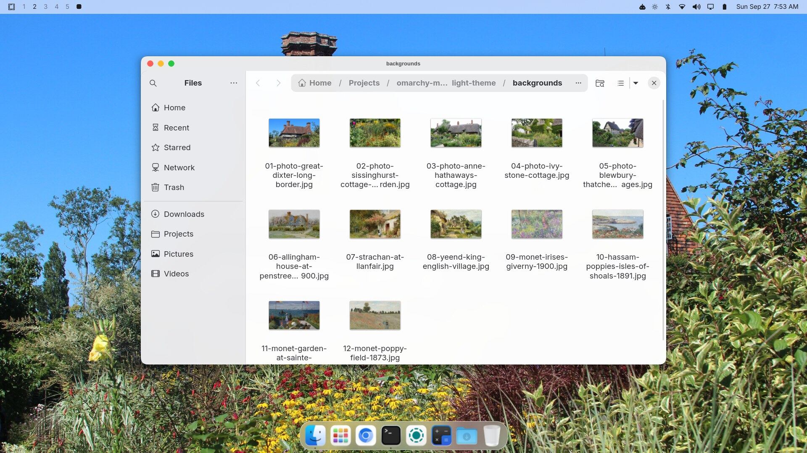
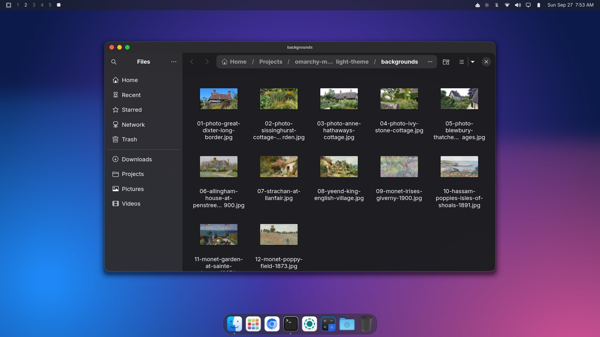

# macOS Light for Omarchy

A macOS-inspired theme and desktop for [Omarchy](https://omarchy.org), made for
people who've spent years on a Mac. It comes with a light and a dark theme,
cottage-garden wallpapers, a Mac-style dock, title bars with red/yellow/green
buttons, and the ⌘ keyboard shortcuts your fingers already know.





## Install

There are two ways to install it.

### The whole Mac experience (recommended)

```bash
git clone https://github.com/danielberkompas/omarchy-macos-light-theme.git ~/.local/share/omarchy-macos-light-theme
~/.local/share/omarchy-macos-light-theme/install.sh
```

The installer asks for your password to install a few packages and to build
the title-bar plugin, which takes a few minutes. When it's done, log out and
back in once.

### Just the look

```bash
omarchy theme install https://github.com/danielberkompas/omarchy-macos-light-theme.git
```

This gives you the colours, wallpapers, icons and translucent menu bar only.
Omarchy deliberately doesn't let themes installed this way change keyboard
shortcuts or run scripts, so you won't get the dock, title bars or ⌘ keys.
(The WhiteSur icons need the full installer too.)

## What you get

**Looks**
- **macOS Light** and **macOS Dark** themes using Apple's system colours, with
  terminal colours that are readable in both.
- 12 wallpapers: five photos of real English cottage gardens and seven
  public-domain Impressionist paintings. Switch with ⌃⌘Space.
- A frosted, translucent menu bar laid out like the Mac's: menu on the left,
  status icons and a Mac-style clock on the right.
- Rounded windows with soft shadows, hairline borders, and gentle animations.
- [WhiteSur](https://github.com/vinceliuice/WhiteSur-icon-theme) icons.
- Inter (the closest free match for Apple's San Francisco font) for menus and
  apps, and DejaVu Sans Mono (the font Apple's Menlo was built from) for code.

**Feels**
- **System Settings**: [OmaSettings](https://github.com/twiking/omasettings),
  one searchable window for appearance, the menu bar, windows, keyboard,
  trackpad, displays, sound, Wi-Fi, Bluetooth, power and more. Anything you
  change can be put back. Open it from the gear in the dock or the menu bar.
- **A dock** with Finder, Launchpad, System Settings, a Downloads stack, and Trash. Dots show
  running apps, and it's frosted glass in light and dark mode.
- **Title bars with traffic lights.** Red closes, yellow minimizes into the
  dock with a genie animation, and green maximizes. Chromium gets them too.
- **⌘ Command where it belongs.** The key next to the spacebar acts as ⌘ and
  the one beside it as ⌥ Option, just like a Mac keyboard.
- **Natural scrolling**, tap to click, two-finger right-click, and three-finger
  swipes between desktops.

Light and dark follow whichever theme you pick: switch themes, and the dock,
title bars and window borders switch with it.

## Keyboard shortcuts

| Shortcut | Does |
|---|---|
| ⌘C ⌘V ⌘X | Copy, paste, cut (works in the terminal too) |
| ⌘Z ⇧⌘Z | Undo, redo |
| ⌘A ⌘F ⌘S ⌘P | Select all, find, save, print |
| ⌘T ⌘W ⇧⌘T | New tab, close tab, reopen closed tab |
| ⌘N | New window |
| ⌘Q | Close the window |
| ⌘R ⌘L | Reload, go to the address bar |
| ⌘Space | Open apps (like Spotlight) |
| ⌥⌘Space | Omarchy menu |
| ⌘Tab ⇧⌘Tab | Switch windows |
| ⌘M ⌥⌘M | Minimize to the dock, restore |
| ⌃⌘F | Full screen |
| ⇧⌘3 ⇧⌘4 ⇧⌘5 | Screenshot the screen, an area, or open the capture menu |
| ⌃⌘Q | Lock the screen |
| ⌥⌘Esc | Force quit |
| ⌘K | Show every shortcut |

On the keyboard, ⌘ is the key labelled **Alt** and ⌥ is the **Windows** key.

Some Omarchy shortcuts moved to make room: floating/tiling is ⌥⌘T, the
workspace layout toggle is ⌥⌘L, and the scratchpad is ⌃⌥⌘S. ⇧⌘3/4/5 no longer
move windows to desktops 3–5 (⇧⌥⌘ plus a number still does).

## Making it your own

Everything the installer adds is in plain files you can edit:

| What | Where |
|---|---|
| Keyboard, trackpad, shortcuts, window look | `~/.config/hypr/macos/*.lua` |
| Turn a whole piece off | Comment out its line in `~/.config/hypr/macos.lua` |
| Dock settings (size, auto-hide) | `~/.local/bin/macos-dock` |
| Pinned dock apps | Right-click an icon, or edit `~/.cache/nwg-dock-pinned` |

These load right after Omarchy's defaults and before your own
`~/.config/hypr/*.lua` files, so anything you set in your own files wins.
Updating with `install.sh` replaces the files above, so put personal tweaks in
your own files rather than editing the installed copies.

Or skip the files and use **System Settings**. It saves your changes to your
own files, so they always win over the theme's defaults too.

## Updating and uninstalling

To update, pull the repo and run the installer again:

```bash
cd ~/.local/share/omarchy-macos-light-theme && git pull && ./install.sh
```

To remove everything and put your original files back:

```bash
~/.local/share/omarchy-macos-light-theme/uninstall.sh
```

Everything the installer replaces is saved in
`~/.local/share/omarchy-macos/originals` first. The uninstaller leaves the
packages, icons, hyprbars plugin and System Settings installed, and tells you
how to remove them.

## Requirements

- Omarchy 4 (Hyprland with Lua configuration)
- Tested on Omarchy 4.0.4 with Hyprland 0.56

## Credits

Wallpaper credits and licences are in [CREDITS.md](CREDITS.md). The scripts and
configuration are [MIT licensed](LICENSE).

This project isn't affiliated with or endorsed by Apple. macOS is a trademark
of Apple Inc.
